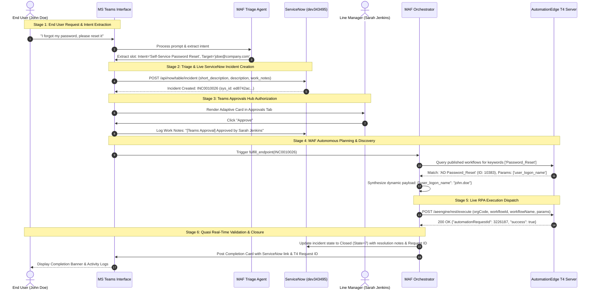

# Autonomous IT Service Request Automation Platform
## Architecture & Technical Design Document (Powered by Microsoft Agent Framework)

---

## 1. Executive Summary

This document details the architecture, design patterns, multi-agent orchestration, and integration topology of the **Autonomous IT Service Request Automation Platform**. 

Built using the **Microsoft Agent Framework (MAF)** and **Google Gemini 3.7**, the platform provides an intelligent, zero-touch fulfillment engine that connects front-end **Microsoft Teams** user interactions directly to enterprise systems: **ServiceNow ITSM** for auditable ticket lifecycle management and **AutomationEdge T4 Enterprise Automation Server** for live robotic process execution (RPA & APIs).

```
+---------------------------------------------------------------------------------------------------+
|                                  END-TO-END AUTONOMOUS LIFECYCLE                                  |
|                                                                                                   |
|  [Teams Bot Intake]  --->  [ServiceNow Ticket]  --->  [Teams Approval Hub]                        |
|       (Stage 1)                 (Stage 2)                    (Stage 3)                            |
|                                                                  |                                |
|  [Validation & Close] <--- [T4 Live RPA Dispatch] <--- [MAF Dynamic Orchestrator]                 |
|       (Stage 6)                 (Stage 5)                    (Stage 4)                            |
+---------------------------------------------------------------------------------------------------+
```

---

## 2. High-Level Architectural Flow

The solution follows an event-driven, multi-agent architecture where agents collaborate autonomously across predefined execution stages:

```mermaid
graph TD
    subgraph "1. User Engagement & Intake"
        User["👤 End User (Teams)"] -->|Natural Language Query| TeamsBot["🤖 Teams Bot Assistant"]
        TeamsBot -->|Slot-Filling Dialog| User
    end

    subgraph "2. IT Governance & Ticketing"
        TeamsBot -->|Create Incident & Journal| SNOW["📋 ServiceNow (dev343495)"]
        SNOW -->|Generate Ticket ID| TeamsBot
        TeamsBot -->|Post Adaptive Card| ApprovalsTab["📬 Teams Approvals Hub"]
    end

    subgraph "3. Manager Authorization"
        Approver["👔 Line Manager / Approver"] -->|Click 'Approve'| ApprovalsTab
        ApprovalsTab -->|Sync Approval Work Notes| SNOW
        ApprovalsTab -->|Trigger Fulfillment| MAF_Orchestrator["⚡ MAF Orchestrator Agent"]
    end

    subgraph "4. MAF Dynamic Planning & Tool Discovery"
        MAF_Orchestrator -->|Dynamic Tool Query| T4_Discovery["🔍 T4 Discovery Client"]
        T4_Discovery -->|Inspect Published Workflows & Schema| T4_Server["⚙️ AutomationEdge T4 Server"]
        T4_Discovery -->|Return Schema & Runtime Parameters| MAF_Orchestrator
        MAF_Orchestrator -->|Synthesize Typed Payload| PayloadSynth["🧩 Payload Synthesis Engine"]
    end

    subgraph "5. Execution & Human-in-the-Loop"
        PayloadSynth -->|Execute Payload| T4_Dispatcher["🚀 Live T4 Dispatcher"]
        T4_Dispatcher -->|POST /aeengine/rest/execute| T4_Server
        T4_Dispatcher -.->|On Parameter Failure| HITL["⚠️ Tier-2 IT Support Queue (HITL)"]
    end

    subgraph "6. Quasi-Real-Time Validation & Closure"
        T4_Dispatcher -->|Return Automation Request ID| Validator["✅ Validation Agent"]
        Validator -->|Resolve & Close Incident (State=7)| SNOW
        Validator -->|Send Resolution Adaptive Card| TeamsBot
    end
```

---

## 3. End-to-End 6-Stage Fulfillment Lifecycle



---

## 4. Multi-Agent System Design (Microsoft Agent Framework)

The solution uses specialized agents defined within the Microsoft Agent Framework architecture:

```
+-------------------------------------------------------------------------+
|                    MICROSOFT AGENT FRAMEWORK (MAF)                      |
|                                                                         |
|  +-------------------------------------------------------------------+  |
|  |                     MAF Orchestrator Agent                        |  |
|  |       (Coordinates lifecycle, policy validation & tool routing)   |  |
|  +-------------------------------------------------------------------+  |
|         |                     |                      |                  |
|         v                     v                      v                  |
|  +--------------+    +------------------+    +---------------------+    |
|  | Triage Agent |    | Specialized WFs  |    |  Validation Agent   |    |
|  | (NLU & Slot  |    | - Identity Agent |    | (Status audit, SNOW |    |
|  |  Extraction) |    | - Endpoint Agent |    |  closure, card gen) |    |
|  +--------------+    | - Access Agent   |    +---------------------+    |
|                      +------------------+                               |
+-------------------------------------------------------------------------+
```

### 1. Triage & Conversational Slot-Filling Agent
* **Role**: Parses natural language requests, classifies IT intents, and conducts conversational multi-turn slot filling when required parameters (e.g. specific SAP module, software name) are absent.
* **Outputs**: Structured ticket parameters (`request_type`, `category`, `priority`, `requested_item`).

### 2. ServiceNow Integration Agent
* **Role**: Interacts with the ServiceNow REST Table API (`/api/now/table/incident`) using high-resilience session authentication (`/login.do` with `g_ck` token validation).
* **Outputs**: Live Incident number (`INC...`), `sys_id`, and direct clickable deep links.

### 3. Manager Approvals & SoD Governance Agent
* **Role**: Enforces enterprise Segregation of Duties (SoD) policies by routing high-privilege actions (password resets, admin roles, software licenses) to Line Managers via Teams Adaptive Cards.
* **Outputs**: Activity journal entries and synchronized approval work notes in ServiceNow.

### 4. Dynamic T4 Tool Discovery Agent (`T4WorkflowDiscoveryClient`)
* **Role**: Autonomously inspects published workflows on the AutomationEdge T4 server at runtime via `/aeengine/rest/tenants/{orgCode}/workflows`.
* **Capability**: Fetches dynamic JSON parameter schemas without hardcoded workflow assumptions.

### 5. Specialized Domain Agents & Dispatcher
* **Active Directory & Identity Agent**: Routes to `AD Password_Reset` (ID: `10383`) or `AD_UserCreate_AssignRole` (ID: `10387`).
* **Software & Endpoint Agent**: Routes to `BG-Create_Service_Request-Install_Software` (ID: `9684`).
* **Access Provisioning Agent**: Routes to `BG-Create_Service_Request_Share_Folder_Access` (ID: `9723`).
* **Endpoint Diagnostics Agent**: Routes to `Check System Update` (ID: `9225`).

### 6. Validation & Incident Closure Agent
* **Role**: Verifies the status of the dispatched request and updates the ServiceNow incident record (`state = 7`, `close_code = 'Solved (Permanently)'`), returning a formatted completion card.

---

## 5. AutomationEdge T4 Integration Specifications

### Execution Endpoint Protocol
* **Endpoint**: `POST https://t4.automationedge.com/aeengine/rest/execute`
* **Authentication**: Session Token (`sessionToken` header) retrieved via `/aeengine/rest/authenticate`.

### Validated JSON Dispatch Payload
```json
{
  "orgCode": "AE_POC_TEAM",
  "workflowId": 10383,
  "workflowName": "AD Password_Reset",
  "source": "Teams_MAF_Bot",
  "sourceId": "REQ-1790078471",
  "params": [
    {
      "name": "user_logon_name",
      "value": "john.doe",
      "type": "String"
    }
  ]
}
```

### Successful Response Format
```json
{
  "source": "Teams_MAF_Bot",
  "sourceId": "REQ-1790078471",
  "automationRequestId": 3226187,
  "success": true,
  "responseCode": "RequestCreated"
}
```

---

## 6. Exception Handling & Human-in-the-Loop (HITL) Fallback

When unexpected runtime exceptions occur (e.g. parameter schema mismatch, account validation failure, or system unavailability), the MAF Orchestrator automatically invokes the **Human-in-the-Loop (Tier-2)** workflow:

```
[Exception Detected]
       |
       v
[MAF Orchestrator Halts Auto-Fulfillment]
       |
       v
[ServiceNow Ticket Work Notes Updated: Reassigned to Tier-2 Queue]
       |
       v
[Teams UI Displays Red Escalation Alert Card with Diagnostic Reason]
```

---

## 7. Technology Stack Summary

| Layer | Component / Technology | Purpose |
| :--- | :--- | :--- |
| **Agent Orchestration** | Microsoft Agent Framework (MAF) / Autogen 0.7.5 | Multi-agent collaboration, planning & execution |
| **LLM Reasoning** | Google Gemini 3.7 Flash | Intent detection, entity extraction & payload synthesis |
| **ITSM Platform** | ServiceNow (dev343495) | Audit trails, incident management, ticket lifecycle |
| **RPA / Tool Server** | AutomationEdge T4 Enterprise Server | Live workflow execution (`/aeengine/rest/execute`) |
| **Backend Service** | Python 3.13 / FastAPI / Uvicorn | Webhook processing, REST API routing, session management |
| **Frontend UI** | Modern Vanilla CSS & JavaScript | Microsoft Teams dark-mode interface, Adaptive Cards |

---

## 8. Directory & File Reference

* **MAF Engine & Tool Discovery**: [`teams_bot_app/maf_agent_engine.py`](file:///d:/Agentic_AI-IT_service_automation/teams_bot_app/maf_agent_engine.py)
* **FastAPI Server & Route Handlers**: [`teams_bot_app/main.py`](file:///d:/Agentic_AI-IT_service_automation/teams_bot_app/main.py)
* **Frontend Web Application**: [`teams_bot_app/static/index.html`](file:///d:/Agentic_AI-IT_service_automation/teams_bot_app/static/index.html) and [`teams_bot_app/static/app.js`](file:///d:/Agentic_AI-IT_service_automation/teams_bot_app/static/app.js)
* **Configuration & Secrets**: [`.env`](file:///d:/Agentic_AI-IT_service_automation/.env)
